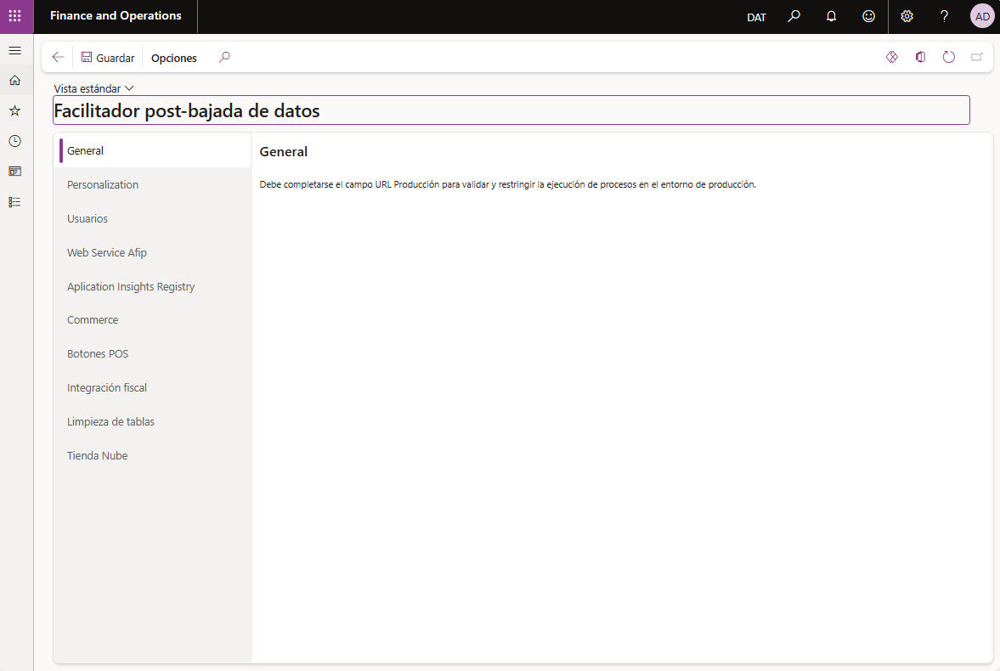
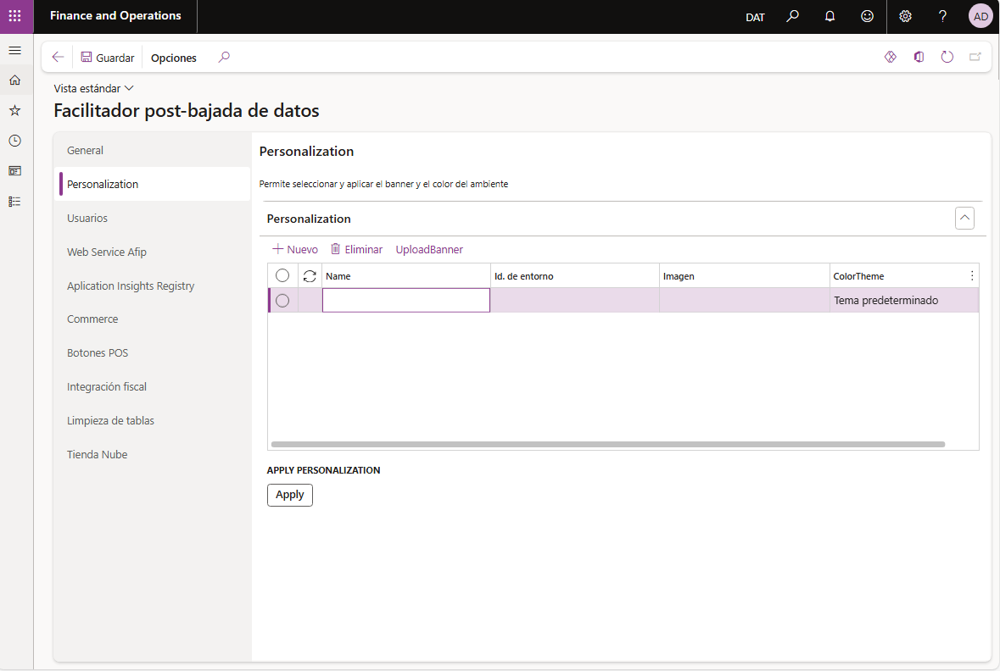
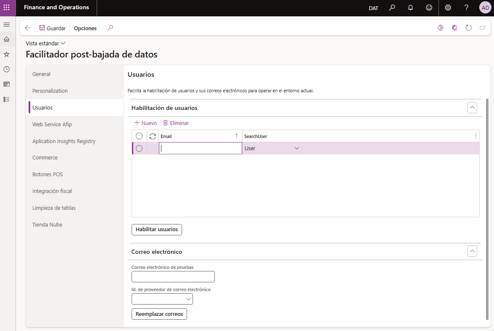
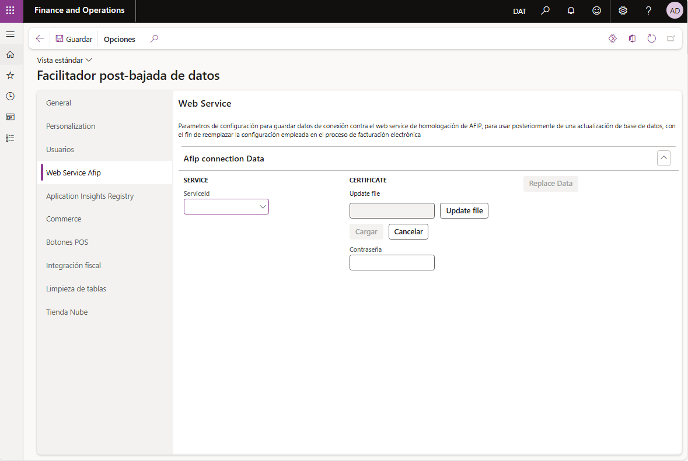
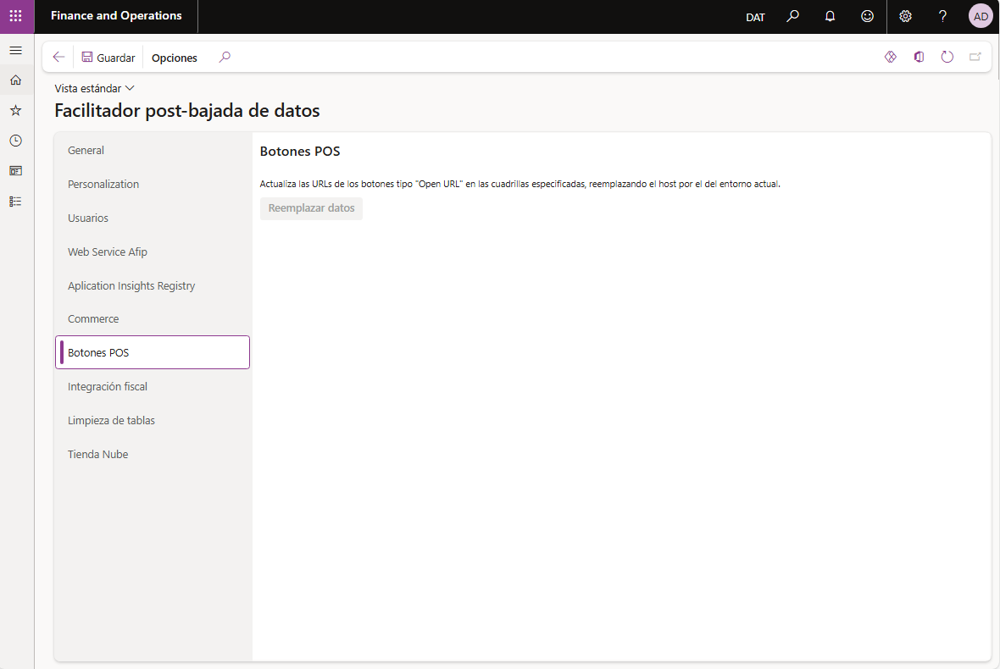
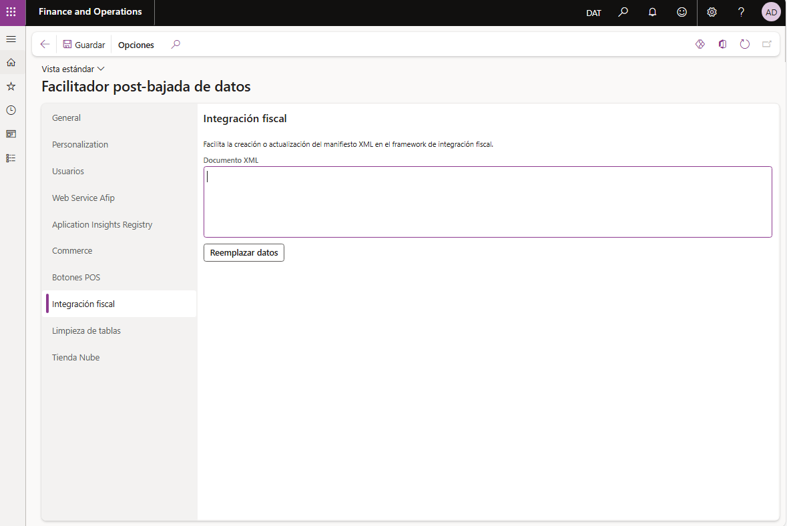
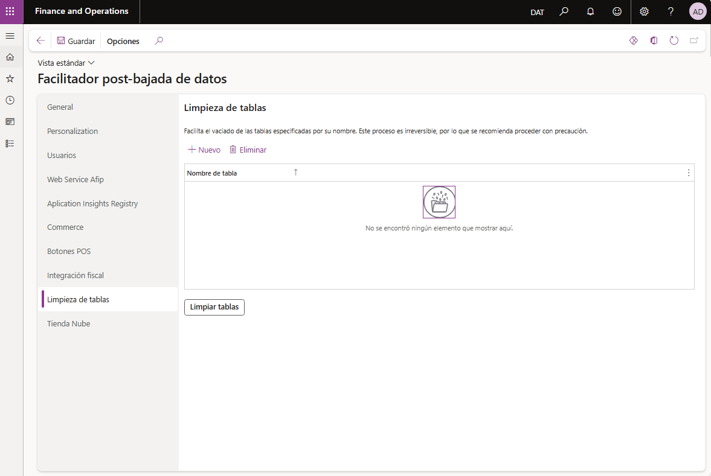

# Facilitador post-bajada de datos: Modelo `DevAxRefreshData`

## Introducción

Este documento describe el desarrollo realizado por **Axxon Consulting** con el objetivo de asistir al usuario final en tareas recurrentes que se realizan luego de completar la bajada de datos de un entorno. 

El modelo `DevAxRefreshData` actúa como un facilitador que automatiza y optimiza procesos clave relacionados con la actualización, reemplazo y aplicación de datos en el sistema, permitiendo así una configuración más rápida, segura y controlada.

## Objetivo

El principal objetivo de este facilitador es reducir el esfuerzo manual requerido para configurar un entorno luego de una bajada de datos, evitando así omisiones o errores humanos que puedan comprometer la integridad o consistencia de los datos. Este modelo busca:

- Agilizar las tareas post-bajada de datos.
- Automatizar configuraciones frecuentes.
- Estandarizar procedimientos necesarios.
- Minimizar riesgos asociados al error humano.

## Descripción del Modelo

`DevAxRefreshData` permite ejecutar de manera centralizada diversas acciones que, de forma habitual, implicarían recorrer manualmente múltiples formularios y aplicar modificaciones individuales. Con este modelo, el usuario puede:

- Reemplazar valores específicos en tablas clave.
- Actualizar parámetros de configuración según el entorno.
- Aplicar rutinas de ajuste que normalmente se harían manualmente.
- Ejecutar scripts o procesos definidos como parte del flujo post-bajada.

Representa una herramienta clave para entornos que requieren frecuentes actualizaciones de datos. Su implementación permite un proceso más ágil, predecible y controlado, facilitando el trabajo de los equipos técnicos y asegurando que los procedimientos posteriores a la bajada de datos se ejecuten de forma completa y correcta.

## Procedimientos Automatizados

A continuación, se detallan algunos de los procedimientos incorporados al facilitador:

### Personalizaciones

Esta funcionalidad permite almacenar y aplicar personalizaciones visuales específicas para cada entorno, facilitando su reutilización luego de una bajada de datos. De este modo, se agiliza la restauración de elementos clave de la interfaz, tales como:

- **Banner principal**
- **Tema de la interfaz (color)**

Antes de aplicar los cambios, el modelo valida que el entorno seleccionado coincida con el entorno actual de ejecución. En caso de discrepancia, las personalizaciones no se aplican.

### Usuarios

Esta funcionalidad permite habilitar usuarios específicos en el entorno actual de Dynamics 365 FO, permitiéndoles así el acceso al sistema tras una bajada de datos. El modelo identifica a los usuarios a través de su **alias**, ofreciendo dos modos de búsqueda:

- **Search User = User**: busca y habilita usuarios por alias exacto.
- **Search User = Pattern**: permite habilitar múltiples usuarios que coincidan con un patrón definido (por ejemplo, por dominio o prefijo).

Adicionalmente, esta sección permite actualizar de forma masiva las credenciales de correo electrónico asociadas a todos los usuarios definidos bajo el modo **Search User = User**, agilizando tareas de configuración para pruebas.

### Web Service Afip

Automatiza el reemplazo del certificado digital utilizado para la conexión con los servicios web de AFIP, facilitando la transición hacia entornos de **testing**.

Esta acción permite:

- Sustituir de forma rápida el certificado de producción por uno de pruebas.
- Evitar errores manuales en la carga o asignación de credenciales.
- Asegurar que el entorno quede correctamente vinculado con los servicios de prueba de AFIP.

### Aplication Insights Registry

### Commerce

### Botones POS

Esta funcionalidad busca y reemplaza la URL de producción configurada en los botones del Punto de Venta (POS) por la URL correspondiente al entorno actual.

La acción se aplica exclusivamente a botones del tipo **Open URL**, actualizando la acción asociada a cada uno para asegurar que apunten a los servicios o recursos correctos del entorno.

Esto evita errores operativos causados por enlaces rotos o referencias a entornos productivos desde ambientes de desarrollo o prueba.

### Integración fiscal

Esta funcionalidad permite almacenar y reemplazar de forma automatizada el manifiesto XML utilizado en el **Framework de Integración Fiscal (FIF)**.

### Limpieza de tablas

Permite vaciar de forma controlada el contenido de las tablas especificadas en esta sección, facilitando la eliminación de datos no esenciales luego de una bajada de datos.

Está orientado principalmente a:

- **Tablas de logs**.
- **Padrones**.
- **Registros residuales** que no deben conservarse en entornos no productivos.
- **Tablas historicas**.

Esta acción contribuye a mantener el entorno liviano, reducir el volumen de datos innecesarios y evitar errores derivados de información obsoleta.

